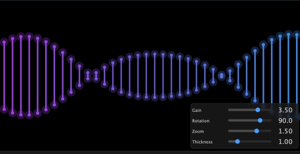

# DNA Visualiser

A real-time audio visualization plugin that creates a stunning DNA helix effect driven by audio input. Built with JUCE framework.


## Features

- **Real-time Audio Visualization**: Dynamic DNA helix that responds to audio input
- **Multi-band Audio Analysis**: Divides audio into frequency bands for detailed visualization
- **Customizable Parameters**:
  - **Gain**: Adjust the height response to audio (0.1 - 5.0)
  - **Rotation**: Rotate the helix visualization (-180° to 180°)
  - **Zoom**: Scale the visualization (0.5x - 2.0x)
  - **Thickness**: Control the line thickness of the helix (0.5 - 3.0)
- **Multiple Plugin Formats**: VST3, AU, and Standalone
- **Low CPU Usage**: Optimized for real-time performance
- **Smooth Animations**: Adaptive smoothing with separate attack and release curves

## Screenshots



*The DNA helix visualization responding to audio input with adjustable parameters for Gain, Rotation, Zoom, and Thickness*

## System Requirements

### Minimum Requirements
- macOS 10.13+ / Windows 10+ / Linux
- 64-bit processor
- VST3 or AU compatible DAW (for plugin formats)

### Recommended
- Modern multi-core processor
- 4GB RAM
- GPU with OpenGL support

## Installation

### Pre-built Binaries

1. Download the latest release from the [Releases](https://github.com/mapleleafjack/DnaVST/releases) page
2. Extract the archive
3. Copy the plugin files to your plugin directory:
   - **macOS VST3**: `~/Library/Audio/Plug-Ins/VST3/`
   - **macOS AU**: `~/Library/Audio/Plug-Ins/Components/`
   - **Windows VST3**: `C:\Program Files\Common Files\VST3\`
   - **Linux VST3**: `~/.vst3/`
4. Restart your DAW

### Building from Source

#### Prerequisites

- CMake 3.24 or higher
- A C++17 compatible compiler
  - macOS: Xcode 10+
  - Windows: Visual Studio 2019+
  - Linux: GCC 7+ or Clang 5+
- Git

#### Build Instructions

1. **Clone the repository**
   ```bash
   git clone https://github.com/mapleleafjack/DnaVST.git
   cd DnaVST
   ```

2. **Build the plugin**

   **macOS/Linux:**
   ```bash
   cmake -B build -DCMAKE_BUILD_TYPE=Release
   cmake --build build --config Release -j8
   ```

   **Windows:**
   ```bash
   cmake -B build
   cmake --build build --config Release
   ```

3. **Find your built plugins**

   Built plugins will be located in:
   ```
   build/DNAVisualiser_artefacts/Release/
   ```

4. **Install plugins** (optional)

   If `COPY_PLUGIN_AFTER_BUILD` is enabled in CMakeLists.txt, plugins will be automatically copied to your system plugin folders. Otherwise, manually copy them from the build artifacts folder.

## Usage

### As a Plugin

1. Load "DNA Visualiser" in your DAW as an insert effect on any audio track
2. The plugin is an audio pass-through effect, so it won't alter your audio
3. Adjust the visualization parameters:
   - **Gain**: Increase to make the helix more responsive to audio
   - **Rotation**: Rotate the view to your preferred angle
   - **Zoom**: Zoom in/out for better visibility
   - **Thickness**: Adjust line thickness for visual preference
4. Resize the plugin window for a larger visualization

### As a Standalone App

1. Launch the standalone application
2. Select your audio input device from the settings
3. Play audio through your input device and watch the visualization respond
4. Adjust parameters in real-time

## Parameters

| Parameter | Range | Default | Description |
|-----------|-------|---------|-------------|
| Gain | 0.1 - 5.0 | 3.5 | Controls how much the audio affects the helix height |
| Rotation | -180° - 180° | 90° | Rotates the helix visualization |
| Zoom | 0.5 - 2.0 | 1.5 | Scales the visualization size |
| Thickness | 0.5 - 3.0 | 1.0 | Controls the line thickness of the helix strands |

## Project Structure

```
DnaVST/
├── CMakeLists.txt          # CMake configuration
├── README.md               # This file
├── Source/                 # Source code
│   ├── DNA.cpp            # DNA helix rendering logic
│   ├── DNA.h              # DNA class header
│   ├── PluginEditor.cpp   # GUI implementation
│   ├── PluginEditor.h     # GUI header
│   ├── PluginProcessor.cpp # Audio processing
│   └── PluginProcessor.h   # Processor header
└── build/                  # Build output (generated)
```

## Development

### Customization

You can customize this template for your own projects:

1. **Change Project Name**: Edit `CMakeLists.txt` line 4
   ```cmake
   project(YourPluginName VERSION 0.0.1)
   ```

2. **Update Plugin Metadata**: Edit `CMakeLists.txt` lines 33-46
   ```cmake
   juce_add_plugin(${PROJECT_NAME}
       COMPANY_NAME "Your Name"
       BUNDLE_ID com.yourname.yourplugin
       # ... other settings
   )
   ```

3. **Add Source Files**: Update the `SourceFiles` list in `CMakeLists.txt`

### Adding Features

- Audio processing happens in `PluginProcessor.cpp`
- Visualization rendering is in `DNA.cpp`
- GUI layout is in `PluginEditor.cpp`
- Parameters are defined in `createParameterLayout()` in `PluginProcessor.cpp`

### Building for Different Platforms

The CMake configuration supports cross-platform builds. Simply run the build commands on your target platform.

## Technology Stack

- **Framework**: [JUCE](https://juce.com/) 7.x
- **Build System**: CMake
- **Package Manager**: CPM (CMake Package Manager)
- **Language**: C++17

## Contributing

Contributions are welcome! Please feel free to submit a Pull Request.

1. Fork the repository
2. Create your feature branch (`git checkout -b feature/AmazingFeature`)
3. Commit your changes (`git commit -m 'Add some AmazingFeature'`)
4. Push to the branch (`git push origin feature/AmazingFeature`)
5. Open a Pull Request

## License

This project is licensed under the MIT License - see the LICENSE file for details.

## Credits

- **Developer**: Jack Musajo
- **Framework**: JUCE by JUCE

## Support

For issues, questions, or suggestions:
- Open an issue on [GitHub](https://github.com/mapleleafjack/DnaVST/issues)
- Contact: jack@mapleleafjack.com

## Changelog

### Version 0.0.1 (Current)
- Initial release
- DNA helix visualization
- Real-time audio analysis
- Four adjustable parameters (Gain, Rotation, Zoom, Thickness)
- VST3, AU, and Standalone formats

## Roadmap

- [ ] Add color customization options
- [ ] Implement preset system
- [ ] Add more visualization modes
- [ ] Performance optimizations
- [ ] MIDI control support
- [ ] Additional audio analysis modes

---

Made with ❤️ using JUCE
